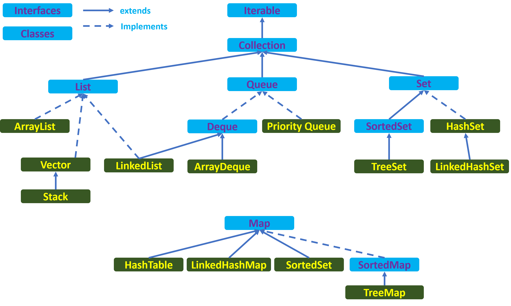

### Regular:
- #####General collection interfaces (Collection, Set, Map, List, Queue, SortedSet, SortedMap)
- #####Interfaces extending Collection. Is Map part of Collection interface?
  
- #####Difference between ArrayList and LinkedList
    1 Performance
    
        a. get(int index) or search operation :  ArrayList get(int index) operation runs in constant time i.e O(1)  while LinkedList get(int index) operation run time is O(n) .
    
        b. insert() or add(Object) operation :  Insertions in LinkedList are generally fast as compare to ArrayList.In LinkedList adding or insertion is O(1) operation . While in ArrayList, if array is full i.e worst case,  there is extra cost of  resizing array and copying elements to the new array , which makes runtime of add operation in ArrayList O(n) , otherwise it is O(1) .

        c. remove(int) operation :  Remove operation in LinkedList is generally same as ArrayList i.e. O(n). In LinkedList , there are two overloaded remove methods. one is remove() without any parameter which removes the head of the list and runs in constant time O(1). The other overloaded remove method in LinkedList is remove(int) or remove(Object) which removes the Object or int passed as parameter . This method traverses the LinkedList until it found the Object and unlink it from the original list . Hence this method run time is O(n).

    2  Reverse  Iterator :  LinkedList can be iterated in reverse direction using descendingIterator() while there is no descendingIterator() in ArrayList , so we need to write our own code to iterate over the ArrayList in reverse direction.

    3 Memory Overhead :  Memory overhead in LinkedList is more as compared to ArrayList as node in LinkedList needs to maintain the addresses of next and previous node.
 - Difference between Stack and Queue (Stack - LIFO and Queue is FIFO)
 - **Internal structure of HashMap**
 - TreeSet vs TreeMap:
 
    1 Both TreeMap and TreeSet do not permit null values
    
    2 Both TreeMap and TreeSet provides guaranteed log(n) time cost for operation like get, put, containsKey and remove.
    
    3 Both TreeMap and TreeSet are not synchronized
    
    4 Both TreeMap and TreeSet are sorted. Sorted order can be natural sorted order defined by Comparable interface or custom sorted order defined by Comparator interface.
    
    5 How works when comparator return `-1` but equals said `true`
      
### Senior:
- Requirements for implementation of hashCode to achieve best performance:
 1 Selecting Fields: So the set of fields used for hashing should be a subset of the fields used for equality.
 
 2 Consistency: Better not use mutable fields for hash code computation
 
 3 Performance: common hash code algorithm + `Objects.hash`
 
 4 Collisions: more details we include in the computation, the more likely it is for the hash codes to differ + used random numbers

